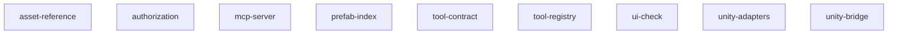

# 架构概览

> 由 wiki_gen 生成。

## 声明架构

- 架构风格: layered
- 主语言: csharp

## 模块映射

| 模块 | 路径 | 职责 | 接口 | 实体 |
|--------|-------|---------|------------|----------|
| asset-reference | `UIProbe/Core/Services`, `UIProbe/UIProbeWindow_AssetReferences.cs` | AssetReferenceService(只读),统一处理某资源被哪些 prefab / 节点 / 组件使用。不另存副本,查询时基于 prefab-index 模块的 PrefabIndex 派生。支持按资源路径、资源名、GUID、Sprite 名称、引用类型过滤查询,并可导出 CSV。 | FindReferences, ExportCsv | AssetReferenceQuery, AssetReferenceResult |
| authorization | `mcp-server/src/auth`, `UIProbe/Infrastructure/Authorization` | 权限与授权治理,两个正交维度:Capability Profile(能力面,决定哪些工具/路径可见可调)与 Authorization Mode(批准策略,决定调用时是否需人确认)。Profile 含 SafeDefault/TeamAutomation/TrustedProject/AdminDebug;Mode 含 请求批准/替我批准/完全访问/自定义。配置经 mcp.config.toml(团队共享入库)+ mcp.local.toml(本地覆盖不入库)叠加。写操作经 write_allow/write_deny 路径约束。所有调用落审计 JSONL(不入库)。token 鉴权防同机恶意进程直连。v0.1 只读不触发授权判定,框架预留。 | LoadConfig, Authorize, Audit | CapabilityProfile, AuthorizationMode, AuthDecision |
| mcp-server | `mcp-server/src` | Node/TypeScript 实现的 MCP Server(Orchestrator),对外讲标准 MCP 协议给 AI 客户端,对内通过 HTTP loopback 连 Unity Bridge。负责:连接/会话管理、版本与契约握手、工具发现缓存、把 MCP tool 调用翻译成 Bridge /rpc、Domain Reload 期间退避重试与恢复、把 Unity 端结构化错误透传成 MCP 错误。v0.1 只暴露只读工具,自身不直接碰 Unity API。多 Unity 实例时按 projectPath 路由。 | ListTools (MCP), CallTool (MCP), Handshake | BridgeConnection, ToolCacheEntry, HandshakeResult |
| prefab-index | `UIProbe/Core/Services`, `UIProbe/Core/ResourceScanner.cs`, `UIProbe/Core/ResourceCacheManager.cs`, `UIProbe/Data/PrefabIndexData.cs`, `UIProbe/UIProbeWindow_Indexer.cs` | Prefab Index 是后续工作台的核心底座,优先抽离为 PrefabIndexService(只读)。从 UIProbeWindow_Indexer.cs 抽出查找 prefab、构建 folder tree、收集 Image/RawImage/Prefab/Material 等资源引用、保存加载 IndexCache、搜索展开的非 UI 部分。PrefabIndex 是多个能力的单一数据源 -- 引用追踪、重复检测、嵌套总览、过滤扫描都基于它派生,不各自缓存。先抽离它以验证 ToolContract + Adapter 接缝 + 黄金样本基线闭环。 | BuildIndex, LoadCache, SaveCache | PrefabIndex, PrefabIndexItem, PrefabIndexBuildOptions |
| tool-contract | `UIProbe/Core/Tools/Models` | UIProbe 工具层的唯一权威契约。UI Toolkit 工作台、MCP Server、内部 Flow 全部构造 ToolRequest、消费 ToolResult,差异仅在传输层(进程内调用 vs JSON-RPC)。凡涉及 ToolDescriptor/ToolRequest/ToolResult/Change/Issue/Preview-Execute/错误码的描述,以本契约为准,其他模块只能引用不得另定义。 | UIProbeTool<TParams>, DescribeParams, Validate | ToolDescriptor, ToolRequest, ToolResult |
| tool-registry | `UIProbe/Core/Tools` | 工具注册 / 发现 / 执行的统一入口。注册内置工具与项目扩展工具,维护 descriptor / 参数 schema / 安全等级 / 来源 / 启用状态,统一执行入口与 Preview/Execute 协议,并根据当前 Capability Profile 过滤、禁用或要求确认特定工具。MCP 与 UI 都不得绕过 ToolRegistry 直接调 Service。 | Register, ListTools, DescribeTool | ToolRegistration, OperationTicket |
| ui-check | `UIProbe/Core/Services`, `UIProbe/UIProbeWindow_DuplicateChecker.cs`, `UIProbe/UIProbeWindow_DuplicateCheckerBatch.cs`, `UIProbe/UIProbeWindow_FilterNodeScanner.cs`, `UIProbe/Data/UIProbeChecker.cs` | UICheckService(只读,含结构化报告)-- 这是其他 Unity MCP 难以提供的差异化能力,作为早期采用的核心拉力。把综合检测、重名/重复检测、过滤节点扫描统一成结构化 Issue 模型。初始检测项:重名节点、缺失 Sprite、缺失 Font、不必要 Raycast Target、空 Text、命名规范问题。过滤节点扫描并入本模块作为一类检测规则;复用 prefab-index 的 PrefabIndex。 | RunChecks, GetCheckResults | UICheckRequest, UICheckReport |
| unity-adapters | `UIProbe/Infrastructure/UnityAdapters` | Unity API 抽象接缝,可测性的前提。现有业务大量直接调用 AssetDatabase / PrefabStageUtility / EditorPrefs / File 静态 API,导致 Service 抽离后仍无法单元测试。约定 Service 不直接调用静态 Unity API,而经 Adapter 接口注入 -- 生产用 Unity 实现,测试用内存假体。没有这层接缝,UIProbe.Tests.Editor.asmdef 形同虚设。 | UnityAssetGateway, InMemoryAssetGateway, UnityFileSystem / InMemoryFileSystem | IAssetGateway, IFileSystem, IEditorPrefs |
| unity-bridge | `UIProbe/Infrastructure/Bridge` | Unity Editor 内的本地 HTTP JSON-RPC bridge(v0.1 仅 HTTP + loopback,WebSocket 留 v0.2)。暴露 /health、/rpc、/tools/list、/tools/describe;经 MainThread Dispatcher 把请求投递到 Unity 主线程执行;调用 ToolRegistry 返回结构化结果;Domain Reload 后自动重建并重新上报 capabilities。把 Domain Reload 当成常态而非异常。 | GET /health, POST /rpc, GET /tools/list, /tools/describe | HealthStatus, DispatchJob |

## 边界规则

- 每个模块只能写入其所属路径下的文件。
- 跨模块依赖通过接口定义，不直接导入内部实现。

## 架构决策

- **依赖 prefab-index 而非自建索引**
  - 理由: 单一数据源,保证引用结果与索引一致
  - 备选方案: 独立扫描(数据不一致 + 重复成本)
- **Capability Profile 与 Authorization Mode 正交**
  - 理由: 能力面(能做什么)与批准策略(是否需确认)是独立维度,正交组合覆盖团队/个人多场景
  - 备选方案: 单一权限等级(无法表达能力面与确认策略的独立变化)
- **config.toml 入库 + local.toml 不入库叠加**
  - 理由: 团队基线可共享审查,本地放权不污染仓库不泄露
  - 备选方案: 仅本地配置(团队无法共享基线), 仅入库配置(本地无法临时放权)
- **审计 JSONL 不入版本控制且工具不可写其目录**
  - 理由: 防止 AI 通过工具篡改/清除自己的审计痕迹
  - 备选方案: 审计入库(噪音大且可被工具改写)
- **Node/TypeScript 实现 MCP Server**
  - 理由: MCP 生态成熟,AI 客户端对接成本低,与 Unity 端职责清晰分离
  - 备选方案: C# 内嵌 MCP(与 Editor 生命周期耦合,Domain Reload 风险高)
- **工具缓存以 serverId 为失效边界**
  - 理由: Domain Reload 后工具集可能变化,serverId 变化是天然失效信号
  - 备选方案: TTL 过期(可能用到过期工具集)
- **v0.1 只暴露只读工具**
  - 理由: 先验证端到端链路稳定性,写操作与授权治理留 v0.2
  - 备选方案: v0.1 直接上写操作(链路未验证即引入风险)
- **PrefabIndex 作为单一数据源**
  - 理由: 引用追踪/重复检测/嵌套总览/过滤扫描都基于它派生,避免多份副本不一致
  - 备选方案: 各模块各自扫描缓存(数据不一致风险)
- **首个抽离的 Service**
  - 理由: 是工作台底座,且用它验证 ToolContract + Adapter + 黄金样本闭环
- **一套契约两处消费(UI + MCP)**
  - 理由: 消除双重结果模型定义,差异仅在传输层
  - 备选方案: UI 与 MCP 各自定义结果模型(被否决,会返工)
- **写操作强制 Preview/Execute 两阶段**
  - 理由: Preview 产计划让用户/AI 可审,Execute 凭令牌落地
  - 备选方案: 单阶段直接执行(危险操作不可接受)
- **撤销能力分级 UndoCapability**
  - 理由: 三类既有写流程映射不同撤销机制,不假设单一 backupPath 通吃
  - 备选方案: 统一 backupPath(无法表达 Unity Undo 栈与多级表格回滚)
- **统一错误码 + Retriable**
  - 理由: AI 可据码决策选工具/判重试
  - 备选方案: 自由文本错误(AI 无法机器决策)
- **MCP/UI 统一经 ToolRegistry,不绕过**
  - 理由: 保证安全等级、Profile 过滤、审计、Preview/Execute 一致,避免双实现
  - 备选方案: MCP 直接调 Service(绕过治理,被否决)
- **Attribute 驱动的项目扩展 API**
  - 理由: 项目只写业务工具,不重复实现协议/连接/权限层
  - 备选方案: 项目各自新建 MCP server(正是要消除的现状)
- **Duplicate/FilterScanner 并入 UICheckService**
  - 理由: 都是基于 PrefabIndex 的检测规则,统一 Issue 模型避免多套结果结构
  - 备选方案: 各自独立 Service(结果模型分裂)
- **结构化报告作为 v0.1 核心拉力**
  - 理由: 其他 Unity MCP 难以提供,差异化早期采用动机
- **三个核心 Adapter 接口(Asset/File/EditorPrefs)**
  - 理由: 覆盖现有业务最主要的静态 Unity 依赖,接缝最小且够用
  - 备选方案: 完整 mock 整个 UnityEditor(过度工程), 不抽接缝(则无法单测,被否决)
- **v0.1 仅 HTTP loopback + jobId 轮询**
  - 理由: 最成熟稳妥,WebSocket 进度推送留 v0.2
  - 备选方案: 一开始上 WebSocket(增加 v0.1 不确定性)
- **serverId 变化作为 Domain Reload 信号**
  - 理由: 无需额外心跳协议,Orchestrator 轮询 /health 即可检测
  - 备选方案: 持久化 serverId(无法区分重载,被否决)
- **MainThread Dispatcher 经 EditorApplication.update**
  - 理由: HTTP 监听在后台线程,Unity API 必须主线程,需统一投递边界
  - 备选方案: 在监听线程直接调 Unity API(崩溃,被否决)

## 错误策略

- **approach**: 统一 ToolError 错误码体系(见 ToolContract.md §6)。C# 异常 / Node 协议错误 / 审计错误共用一套码,每个错误带 Retriable 标志。
- **retry_policy**: AI 据 ToolError.Retriable 决定是否重试或换工具。Domain Reload 中断按工具 ReloadSafe 决定 -- 幂等只读(ReloadSafe=true)可自动重发,写操作返回 DOMAIN_RELOAD_INTERRUPTED 默认交人确认不自动重试。
- **fallback_behavior**: 写操作两阶段(Preview 产计划 / Execute 凭令牌落地)。失败返回结构化 ToolResult{Status,Error},绝不静默崩溃;配置迁移失败回退默认 + 显著告警 + 写审计。

## 模块依赖图



```
Module Dependencies
┌─────────────────┐  ┌─────────────────┐  ┌─────────────────┐  ┌─────────────────┐
│ asset-reference │  │ authorization   │  │ mcp-server      │  │ prefab-index    │
└─────────────────┘  └─────────────────┘  └─────────────────┘  └─────────────────┘

┌─────────────────┐  ┌─────────────────┐  ┌─────────────────┐  ┌─────────────────┐
│ tool-contract   │  │ tool-registry   │  │ ui-check        │  │ unity-adapters  │
└─────────────────┘  └─────────────────┘  └─────────────────┘  └─────────────────┘

┌─────────────────┐
│ unity-bridge    │
└─────────────────┘

(no inter-module edges detected)
```

## 跨模块依赖

依赖图工具未自动探测出边,但设计上存在明确的派生/调用关系(单向,无环):

- **tool-contract** 是所有模块的契约根:tool-registry / unity-bridge / mcp-server / 各 Service 全部引用其类型,自身不依赖任何模块。
- **unity-adapters** 提供 IAssetGateway/IFileSystem/IEditorPrefs 接缝,被各 Service 经构造注入;自身不依赖业务模块。
- **prefab-index** 是数据底座(单一数据源):**asset-reference** 与 **ui-check** 均基于其 PrefabIndex 派生,不自建索引。
- **tool-registry** 注册并发现各 Service 包装的工具,依赖 tool-contract;MCP 与 UI 不得绕过它直接调 Service。
- **unity-bridge** 经 MainThreadDispatcher 调 tool-registry.Invoke,依赖 tool-contract + tool-registry。
- **mcp-server**(Node/TS)经 HTTP loopback 调 unity-bridge 的 /rpc 与 /tools,不直接依赖任何 C# 模块(跨进程,经契约 JSON)。
- **authorization** 横切于 tool-registry 调用判定与 mcp-server 配置;v0.1 只读不触发判定,框架预留,v0.2(M5)落地。

依赖方向:`tool-contract` → 其余;`unity-adapters` → 各 Service;`prefab-index` → {asset-reference, ui-check};`tool-registry` → 各工具;`unity-bridge` → tool-registry;`mcp-server` →(跨进程)→ unity-bridge。
